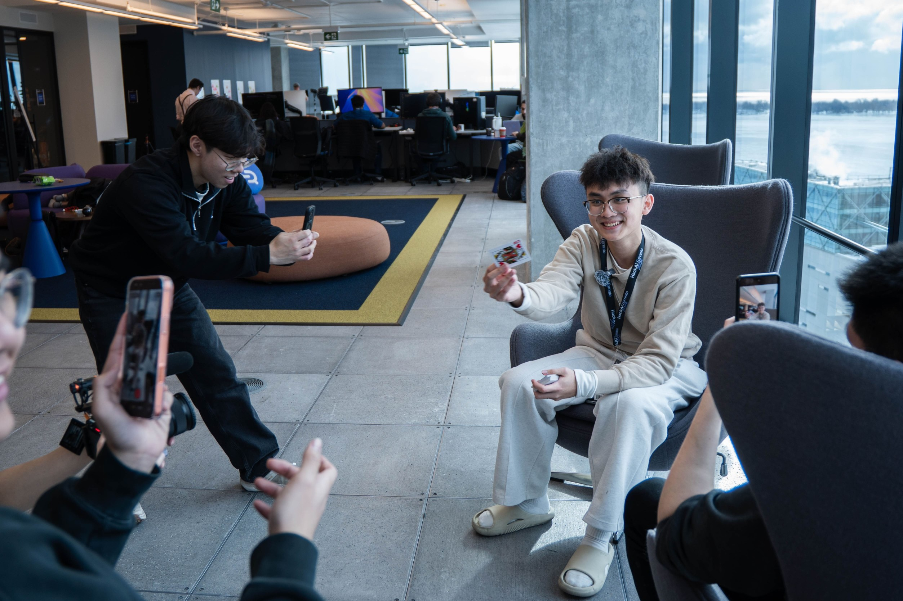

  

  

  
  
  

  

# About Me
- i started my programming journey on march 19th 2025
- i do things above your expectation
- i love asking why and how things work
- i am lazy so i try to make things efficient
- i like to be different from others

 

# Skills

  
  
  
  
  
  
  
  
  
  
  
  
   
  
  
  
  
  
  
  

 

# Hackathons

<table align="left" cellpadding="10">
  <tr>
    <td width="350px" valign="top">
      2026 
      • organizer @ GenAI Genesis 
      • hacker @ DeltaHacks 
      • 🏆 hacker @ UofTHacks 
      • hacker @ Stan Hackathon 
      • 🏆 hacker @ UTRA Hacks 
      • hacker @ QHacks 
    </td>
    <td width="350px" valign="top">
      2025 
      • organizer @ GenAI Genesis 
      • organizer @ EmberHacks 
      • workshop lead @ Ignition Hacks 
      • 🏆 hacker @ GoOnHacks 
      • hacker @ TechTO Hackathon 
      • hacker @ Hack The North 
      • 🏆 hacker @ WallyHacks 
    </td>
  </tr>
</table>
