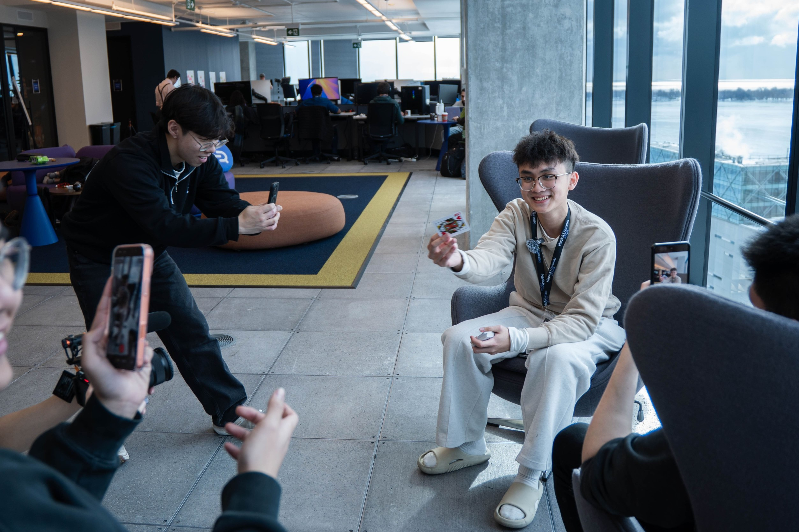

  

  

  
  
  

  

# About Me
- i started my programming journey on march 19th 2025
- i do things above your expectation
- i love asking why and how things work
- i am lazy so i try to make things efficient
- i like to be different from others

 

# Skills

  
  
  
  
  
  
  
  
  
  
  
  
   
  
  
  
  
  
  
  

 

# Hackathons

<table align="left" cellpadding="10">
  <tr>
    <td width="350px" valign="top">
      2026 
      • 1 - founder @ SOON Hackathon 
      • 2 - organizer @ GenAI Genesis 
      • 3 - judge @ FraserHacks  
      • 4 - judge, workshop lead @ BearHacks  
      • 5 - hacker @ DeltaHacks 
      • 6 - 🏆 hacker @ UofTHacks 
      • 7 - hacker @ Stan Hackathon 
      • 8 - 🏆 hacker @ UTRA Hacks 
      • 9 - 🏆 hacker @ QHacks 
      • 10 - hacker @ AI Agents Voice Hackathon  
      • 11 - 🥉 hacker @ SmileHacks  
      • 12 - 🥇 hacker @ Hack The Future  
      • 13 - hacker, workshop lead @ DeerHacks  
      • 14 - 🏆 hacker @ Hack Canada  
      • 15 - hacker @ Hack The Globe  
      • 16 - 🏆 hacker @ Stupid Ideas Hackathon  
      • 17 - hacker @ sandcastle  
      • 18 - hacker @ NVIDIA Spark Hackathon  
      • 19 - 🏆 hacker @ Agentic AI Build Week  
      • 20 - 🏆 hacker @ Hack The 6ix  
      • 21 - 🥇 hacker @ SummerHacks  
      • 22 - incoming @ Pivot Hacks  
      • 23 - incoming @ Hack The North  
      • 24 - incoming @ FormulaTech Hacks  
    </td>
    <td width="350px" valign="top">
      2025 
      • 1 - organizer @ EmberHacks 
      • 2 - workshop lead @ Ignition Hacks 
      • 3 - 🏆 hacker @ GoOnHacks 
      • 4 - hacker @ TechTO Hackathon 
      • 5 - hacker @ Hack The North 
      • 6 - 🏆 hacker @ WallyHacks 
    </td>
  </tr>
</table>
